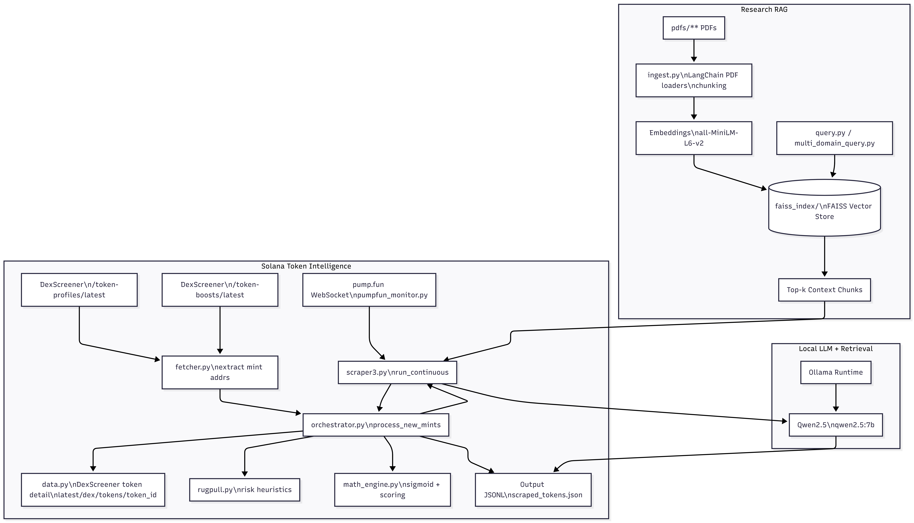

# Paper-generation-Quantum-RAG

## Proof / Demo

Add your screenshot here (store it in `docs/images/` so it renders on GitHub):



Local **RAG (Retrieval-Augmented Generation)** workspace for generating research-style papers (Quantum Computing + AGI) from your own documents using a **FAISS** vector index + **sentence-transformers** embeddings + a local **Ollama** LLM.

This repo also includes an optional Solana memecoin monitoring/scraping toolkit under [solana/](solana/) (DexScreener + Pump.fun WebSocket).

## What’s inside

- **RAG ingestion + querying**
  - [ingest.py](ingest.py): build/update a FAISS index from PDFs under `pdfs/` and save it to `faiss_index/`.
  - [query.py](query.py): interactive similarity search against `faiss_index/`.
  - [multi_domain_query.py](multi_domain_query.py): like `query.py`, but supports lightweight “domain” filtering based on the source path.
  - [rag.py](rag.py): a minimal end-to-end example (PyPDF2 + sentence-transformers + in-memory FAISS).
  - [update_rag_with_books.py](update_rag_with_books.py): example of extending an existing FAISS index with additional docs.

- **Paper generators (RAG + Ollama)**
  - [generate_agi_paper.py](generate_agi_paper.py)
  - [generate_qos_paper.py](generate_qos_paper.py)
  - [generate_qram_advanced.py](generate_qram_advanced.py)
  - [generate_quantum_networking_paper.py](generate_quantum_networking_paper.py)
  - [generate_quantum_thermodynamics_paper.py](generate_quantum_thermodynamics_paper.py)

- **Solana tooling (optional)**
  - [solana/](solana/): DexScreener-based market data + Pump.fun real-time new-token discovery.

## Setup

### 1) Python environment

Recommended: Python 3.11+.

```bash
python -m venv .venv
.venv\Scripts\activate
pip install -r requirements.txt
```

Note (Windows): If `faiss-cpu` install fails on your Python version, try Python 3.11, or install FAISS via conda (`conda install -c conda-forge faiss-cpu`).

### 2) Install and run Ollama

Install Ollama, then pull a model that fits your RAM.

Example (smaller, good default):

```bash
ollama pull qwen2.5:7b
```

The scripts talk to Ollama at `http://localhost:11434`.

## Build the knowledge base (FAISS index)

Place your PDFs under `pdfs/` (this folder is intentionally gitignored), then run:

```bash
python ingest.py
```

This generates `faiss_index/` (also gitignored because it’s a build artifact).

## Query the knowledge base

Interactive query:

```bash
python query.py
```

Domain-aware query:

```bash
python multi_domain_query.py
```

## Generate papers

All paper generators assume:
- `faiss_index/` exists (run `python ingest.py` first)
- Ollama is running and has a compatible model pulled

Examples:

```bash
python generate_agi_paper.py
python generate_qos_paper.py
python generate_qram_advanced.py
python generate_quantum_networking_paper.py
python generate_quantum_thermodynamics_paper.py
```

## Ollama model configuration

Several scripts defaulted to a very large Qwen model originally. If you have limited RAM, prefer a smaller model like `qwen2.5:7b`.

After the small patch in this repo, you can control model + server via environment variables:

```bash
set OLLAMA_MODEL=qwen2.5:7b
set OLLAMA_URL=http://localhost:11434
```

(You can also edit the `model=` argument in the generators if you prefer.)

## Git hygiene / excluded folders

These are intentionally not committed:
- `pdfs/` (large and often copyrighted source material)
- `faiss_index/` (generated index)
- venv folders (`.venv/`, `ragenv/`)
- scraped token outputs (`scraped_tokens*.json`, `seen_mints*.json`)

## Solana toolkit (optional)

If you want the memecoin discovery/scraping tools too:

- DexScreener token detail endpoint is used for full market data
- Pump.fun WebSocket is used for true “new token” discovery (free)

Start points:
- [solana/scraper3.py](solana/scraper3.py)
- [solana/pumpfun_monitor.py](solana/pumpfun_monitor.py)

---

If you want, I can also add a small `Makefile`/`tasks.json` for common commands (ingest/query/generate), but I kept this repo minimal.
